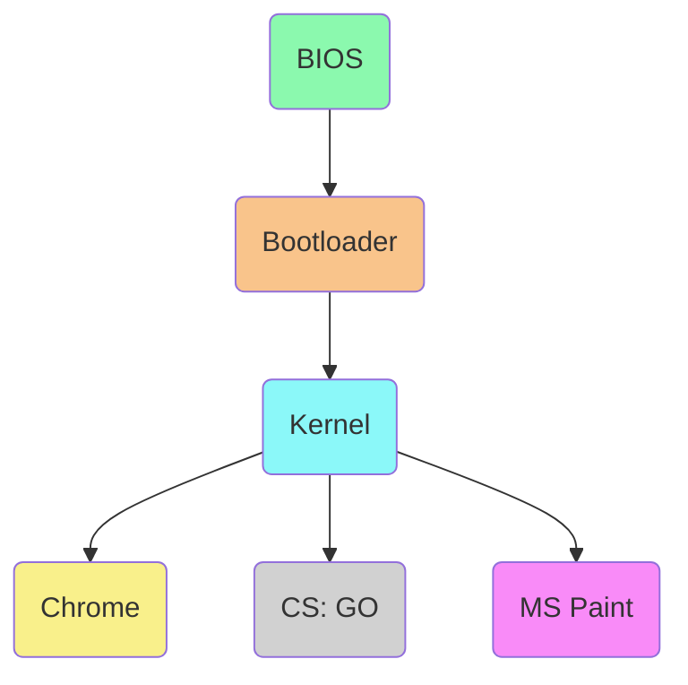
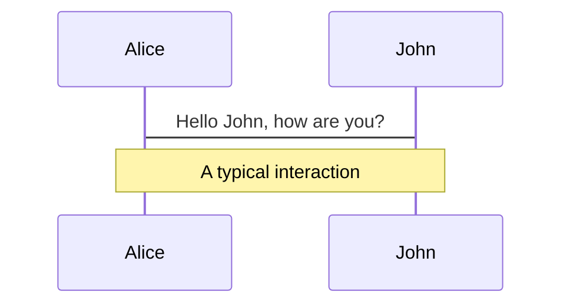
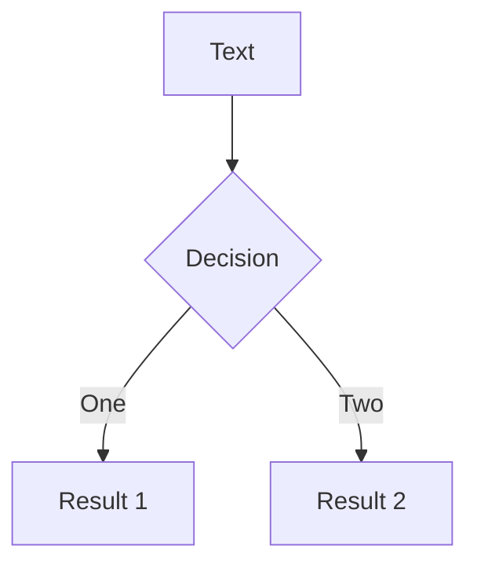
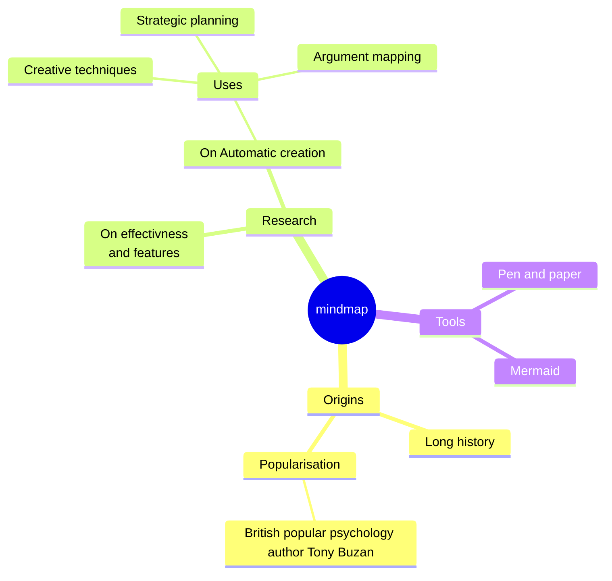
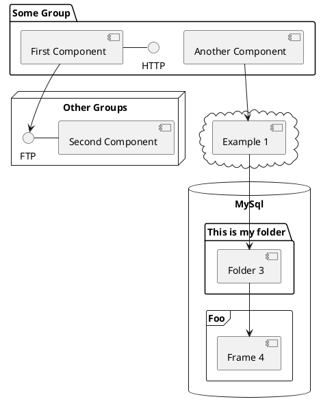

---
# try also 'default' to start simple
theme: default
# random image from a curated Unsplash collection by Anthony
# like them? see https://unsplash.com/collections/94734566/slidev
#background: https://source.unsplash.com/collection/94734566/1920x1080
background: https://images.unsplash.com/photo-1606318005254-bdb2bcd14d34?ixlib=rb-4.0.3&ixid=MnwxMjA3fDB8MHxwaG90by1wYWdlfHx8fGVufDB8fHx8&auto=format&fit=crop&w=1920&h=1080
# apply any windi css classes to the current slide
class: 'text-center'
# https://sli.dev/custom/highlighters.html
highlighter: shiki
# show line numbers in code blocks
lineNumbers: true
title: Honors Presentation 2023
# some information about the slides, markdown enabled
info: |
  ## Honors Project Presentation
  by Henry Allard
# persist drawings in exports and build
drawings:
  persist: false
# page transition
transition: slide-left
# use UnoCSS
css: unocss
# Phase 3:  Formal Presentation and Evaluation  
# The student will prepare a 10 minute slideshow presentation. This will be presented before a panel followed by a 10 minute question and answer session.  
# The presentation for the panel will include video and/or photographic evidence from multiple stages of their project. The rationale behind the project selection should be explained, along with a detailed explanation of what their project entailed, how the student accomplished this, and what they have learned through this process.
# Following the presentation the panel and audience will pose questions to the student. They should be prepared to discuss challenges that they faced, community connections that they developed, and advice they would pass on for others interested in similar endeavors. 
---

<div class="absolute top-10">
  <span class="font-700">
    Henry Allard - 2023
  </span>
</div>

<div class="absolute bottom-10">
  <h1>Senior Honors Project</h1>
  <p>Woohoo! Exokernel baBYYYYYYYYYYYYYYYYYYYYYYYYY!</p>
</div>

<!-- <div class="pt-12">
  <span @click="$slidev.nav.next" class="px-2 py-1 rounded cursor-pointer" hover="bg-white bg-opacity-10">
    Press Space for next page <carbon:arrow-right class="inline"/>
  </span>
</div>

<div class="abs-br m-6 flex gap-2">
  <button @click="$slidev.nav.openInEditor()" title="Open in Editor" class="text-xl slidev-icon-btn opacity-50 !border-none !hover:text-white">
    <carbon:edit />
  </button>
  <a href="https://github.com/slidevjs/slidev" target="_blank" alt="GitHub"
    class="text-xl slidev-icon-btn opacity-50 !border-none !hover:text-white">
    <carbon-logo-github />
  </a>
</div> -->

<!--
The last comment block of each slide will be treated as slide notes. It will be visible and editable in Presenter Mode along with the slide. [Read more in the docs](https://sli.dev/guide/syntax.html#notes)
-->

---
transition: fade-out
layout: iframe
url: http://shinytoylabs.com/jargon/
---

<!--
<spin the jargon wheel> pause. Well, it looks like I'm getting glares from the Honors teachers, so I guess I'm actually going to have to explain what I did. Bear with me though, as it's a little complex.
-->

---
layout: two-cols
transition: slide-right
---

# U talking 'bout a compUter? I know what dat izzz

- I put letters into boxes.
- And when I don't know what letters to put in da box, I google it!
- Actually, there's a little bit more to it than that.
- Have you ever wondered what happens between turning the computer on and crossing off some words?

::right::


---
layout: section
---

# Alrightie then, let's dive into the world of computers!

---
layout: default
---

# Der Computer:

Meet Craig! He's a computer. However, he's basically useless without all his friends (that live inside him).


<!--I was told that naming him would make the audience attached, and cause them to feel emotionally damaged when I killed him later. I'm going for a where the red fern grows type vibe, ya feel?-->

---
layout: default
---

# Craig's friends

Inside Craig, we can find:
- Carmen, the **CPU**, she's the brains of the bunch and can do a bunch of calculations.
- Rico, the **RAM**, he stores all the maths that Carmen will do.
- Harvey, the **Hard Drive**, they store all of the files for the computer.
- Geraldo, the **GPU**, he draws all the little boxes and letters for the crossword.
- Martha, the **Motherboard**, she is like the glue that ties all the parts together.

<div class="grid grid-rows-2 grid-flow-col w-full min-h-64">
  <div class="grid grid-cols-3 grid-flow-row">
    <div class="bg-contain bg-no-repeat bg-center" style='background-image: url("img/carmen.png");'></div>
    <div class="bg-contain bg-no-repeat bg-center" style='background-image: url("img/rico.png");'></div>
    <div class="bg-contain bg-no-repeat bg-center" style='background-image: url("img/harvey.png");'></div>
  </div>
  <div class="grid grid-cols-2 grid-flow-row">
    <div class="bg-contain bg-no-repeat bg-center" style='background-image: url("img/geraldo.png")'></div>
    <div class="bg-contain bg-no-repeat bg-center" style='background-image: url("img/martha.png")'></div>
  </div>
</div>

---
layout: two-cols
---

# But what of this thing called Software?

No, it's not soft. It's the code that Craig runs! He needs some sort of instructions in order to know what to do.

The different pieces of software we are concerened about here are:
* The **BIOS**. This is the *first* thing that runs when the computer turns on. It's called  Basic Input Output System for a reason though, as it is basically useless to the end-user.
* The **Bootloader**. OOOie! This gets a little more spicy as it has to setup the computer and load in the operating system.

::right::



* The **Kernel**. The nuts and bolts of the operating system. It's not talked about a lot but it is the most important piece of software in your computer. NOTHING can happen without one.

<!--The BIOS initializes all the parts of the system. That's Carmen, Geraldo, Harvey, Martha, and Rico. It makes sure everything works and sets any hardware level settings. It will then exhaustively search all connected storage devices for a bootable medium before passing it off to the bootloader. The bootloader then prepares the computer for the operating system. It's kinda a toss up for what functionality is put into the bootloader and what gets thrown into later stages but a basic bootloader will transition the computer to x32 bit mode, query the computer for the amount of ram and other capabilities and then load and execute a kernel. The kernel's job is to make nice abstractions for the programs to use.-->

---
layout: default
---

# One more thing.
What's an operating system?

An operating system is the collection of software that runs on your computer. It's basically everything your computer needs to run. 

It includes:
- the kernel
- your settings app
- the command prompt/terminal
- etc.

---
layout: statement
---

# Clear as mud? All you need know is that a kernel is the lowest piece of software in an operating system and takes care of extremely basic tasks.

---
layout: default
---
# So then, what, exactly, did I do as an Honors project?

I made an operating system!

---
layout: section
---

# Now it's your turn! AMA!

---
layout: default
---

# Table of contents

```
<Toc minDepth="1" maxDepth="5"></Toc>
```

<Toc></Toc>

---
transition: slide-up

level: 2
---

# Navigation

Hover on the bottom-left corner to see the navigation's controls panel, [learn more](https://sli.dev/guide/navigation.html)

### Keyboard Shortcuts

|     |     |
| --- | --- |
| <kbd>right</kbd> / <kbd>space</kbd>| next animation or slide |
| <kbd>left</kbd>  / <kbd>shift</kbd><kbd>space</kbd> | previous animation or slide |
| <kbd>up</kbd> | previous slide |
| <kbd>down</kbd> | next slide |

<!-- https://sli.dev/guide/animations.html#click-animations -->

<p v-after class="absolute bottom-23 left-45 opacity-30 transform -rotate-10">Here!</p>

---
layout: image-right
image: https://source.unsplash.com/collection/94734566/1920x1080
---

# Code

Use code snippets and get the highlighting directly![^1]

```ts {all|2|1-6|9|all}
interface User {
  id: number
  firstName: string
  lastName: string
  role: string
}

function updateUser(id: number, update: User) {
  const user = getUser(id)
  const newUser = { ...user, ...update }
  saveUser(id, newUser)
}
```

<arrow v-click="3" x1="400" y1="420" x2="230" y2="330" color="#564" width="3" arrowSize="1" />

[^1]: [Learn More](https://sli.dev/guide/syntax.html#line-highlighting)

<style>
.footnotes-sep {
  @apply mt-20 opacity-10;
}
.footnotes {
  @apply text-sm opacity-75;
}
.footnote-backref {
  display: none;
}
</style>

---

# Components

<div grid="~ cols-2 gap-4">
<div>

You can use Vue components directly inside your slides.

We have provided a few built-in components like `<Tweet/>` and `<Youtube/>` that you can use directly. And adding your custom components is also super easy.

```html
<Counter :count="10" />
```

<!-- ./components/Counter.vue -->
<Counter :count="10" m="t-4" />

Check out [the guides](https://sli.dev/builtin/components.html) for more.

</div>
<div>

```html
<Tweet id="1390115482657726468" />
```

<Tweet id="1390115482657726468" scale="0.65" />

</div>
</div>

<!--
Presenter note with **bold**, *italic*, and ~~striked~~ text.

Also, HTML elements are valid:
<div class="flex w-full">
  <span style="flex-grow: 1;">Left content</span>
  <span>Right content</span>
</div>
-->


---
class: px-20
---

# Themes

Slidev comes with powerful theming support. Themes can provide styles, layouts, components, or even configurations for tools. Switching between themes by just **one edit** in your frontmatter:

<div grid="~ cols-2 gap-2" m="-t-2">

```yaml
---
theme: default
---
```

```yaml
---
theme: seriph
---
```


</div>

Read more about [How to use a theme](https://sli.dev/themes/use.html) and
check out the [Awesome Themes Gallery](https://sli.dev/themes/gallery.html).

---
preload: false
---

# Animations

Animations are powered by [@vueuse/motion](https://motion.vueuse.org/).

```html
<div
  v-motion
  :initial="{ x: -80 }"
  :enter="{ x: 0 }">
  Slidev
</div>
```

<div class="w-60 relative mt-6">
  <div class="relative w-40 h-40">
    
    
    
  </div>

  <div
    class="text-5xl absolute top-14 left-40 text-[#2B90B6] -z-1"
    v-motion
    :initial="{ x: -80, opacity: 0}"
    :enter="{ x: 0, opacity: 1, transition: { delay: 2000, duration: 1000 } }">
    Slidev
  </div>
</div>

<!-- vue script setup scripts can be directly used in markdown, and will only affects current page -->
<script setup lang="ts">
const final = {
  x: 0,
  y: 0,
  rotate: 0,
  scale: 1,
  transition: {
    type: 'spring',
    damping: 10,
    stiffness: 20,
    mass: 2
  }
}
</script>

<div
  v-motion
  :initial="{ x:35, y: 40, opacity: 0}"
  :enter="{ y: 0, opacity: 1, transition: { delay: 3500 } }">

[Learn More](https://sli.dev/guide/animations.html#motion)

</div>

---

# LaTeX

LaTeX is supported out-of-box powered by [KaTeX](https://katex.org/).

<br>

Inline $\sqrt{3x-1}+(1+x)^2$

Block
$$
\begin{array}{c}

\nabla \times \vec{\mathbf{B}} -\, \frac1c\, \frac{\partial\vec{\mathbf{E}}}{\partial t} &
= \frac{4\pi}{c}\vec{\mathbf{j}}    \nabla \cdot \vec{\mathbf{E}} & = 4 \pi \rho \\

\nabla \times \vec{\mathbf{E}}\, +\, \frac1c\, \frac{\partial\vec{\mathbf{B}}}{\partial t} & = \vec{\mathbf{0}} \\

\nabla \cdot \vec{\mathbf{B}} & = 0

\end{array}
$$

<br>

[Learn more](https://sli.dev/guide/syntax#latex)

---

# Diagrams

You can create diagrams / graphs from textual descriptions, directly in your Markdown.

<div class="grid grid-cols-3 gap-10 pt-4 -mb-6">









</div>

[Learn More](https://sli.dev/guide/syntax.html#diagrams)

---
src: ./pages/multiple-entries.md
hide: false
---

---
layout: center
class: text-center
---

# Learn More

[Documentations](https://sli.dev) · [GitHub](https://github.com/slidevjs/slidev) · [Showcases](https://sli.dev/showcases.html)

---
layout: end
---

