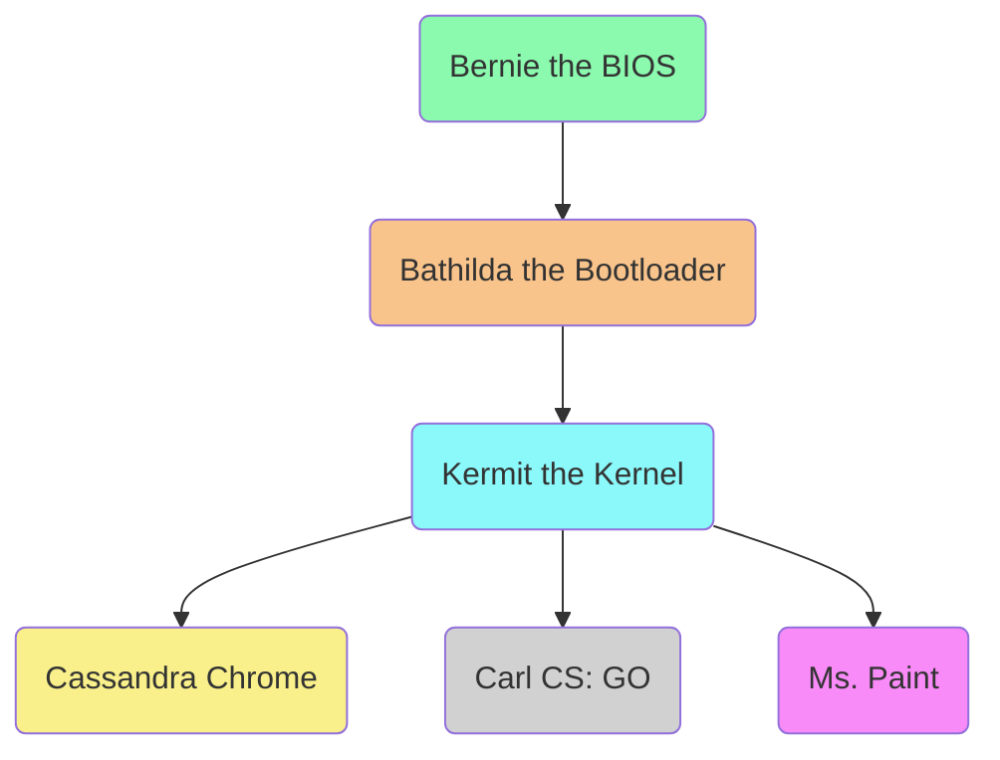

---
# try also 'default' to start simple
theme: default
# random image from a curated Unsplash collection by Anthony
# like them? see https://unsplash.com/collections/94734566/slidev
#background: https://source.unsplash.com/collection/94734566/1920x1080
background: https://images.unsplash.com/photo-1606318005254-bdb2bcd14d34?ixlib=rb-4.0.3&ixid=MnwxMjA3fDB8MHxwaG90by1wYWdlfHx8fGVufDB8fHx8&auto=format&fit=crop&w=1920&h=1080
# apply any windi css classes to the current slide
#class: 'text-center'
# https://sli.dev/custom/highlighters.html
highlighter: shiki
# show line numbers in code blocks
lineNumbers: true
title: Honors Presentation 2023
# some information about the slides, markdown enabled
info: |
  ## Honors Project Presentation
  by Henry Allard
# persist drawings in exports and build
drawings:
  persist: false
# page transition
transition: slide-left
# use UnoCSS
css: unocss

fonts:
  # use Nunito as the sans font
  sans: Nunito

# Phase 3:  Formal Presentation and Evaluation  
# The student will prepare a 10 minute slideshow presentation. This will be presented before a panel followed by a 10 minute question and answer session.  
# The presentation for the panel will include video and/or photographic evidence from multiple stages of their project. The rationale behind the project selection should be explained, along with a detailed explanation of what their project entailed, how the student accomplished this, and what they have learned through this process.
# Following the presentation the panel and audience will pose questions to the student. They should be prepared to discuss challenges that they faced, community connections that they developed, and advice they would pass on for others interested in similar endeavors. 
---

<div class="absolute top-10">
  <span class="font-700">
    Henry Allard - 2023
  </span>
</div>

<div class="absolute bottom-10">
  <h1 class="font-bold">Senior Honors Project</h1>
  <p>Woohoo! Exokernel baBYYYYYYYYYYYYYYYYYYYYYYYYY!</p>
</div>

<style>
.slidev-layout {
  h1 {
    background: -webkit-linear-gradient(0deg, #7ffc7b, #36b500);
    -webkit-background-clip: text;
    -webkit-text-fill-color: transparent;
  }
}
</style>

<!--
The last comment block of each slide will be treated as slide notes. It will be visible and editable in Presenter Mode along with the slide. [Read more in the docs](https://sli.dev/guide/syntax.html#notes)
-->

---
layout: default
---

# **What did I do for my Honors project?**

[Glad you asked!](http://shinytoylabs.com/jargon/)

<v-clicks>

- 🔥 I compressed the firewall in order to get the SSD antenna through the analog DHCP alarm.
- 🔌 Used the haptic USB array to reboot hackers' internet.
- ⚙️ Designed a bluetooth array in a driver, in order to override the interface by encoding its EXE firewall.

</v-clicks>


<!--
<spin the jargon wheel> pause. Well, it looks like I'm getting glares from the Honors teachers, so I guess I'm actually going to have to explain what I did. Bear with me though, as it's a little complex.
-->

---
layout: two-cols
---

# Are you talking about 🖥? I know what they are.

<v-clicks>

- Letters go into boxes.
- And when it's a toss up, just Google™ it!

</v-clicks>

::right::


<!--Try not to be patronizing on this one. Letters get put into boxes. When I don't know the answer, I google it! Well, actually, it's a little more than that. Have you ever wondered what happends between turning the computer on and crossing off some words?-->

---
layout: section
---

<h1 
  v-if="$slidev.nav.currentPage === 4"
  v-motion
  :initial="{
    y: 300,
    opacity: 0
  }"
  :enter="{
    y: 0,
    opacity: 1,
    transition: {
      duration: 1000,
      type: 'keyframes',
    },
  }"
  class="text-bold">Alrightie then, let's dive into the world of computers!</h1>

<style>
.slidev-layout {
  background-image: url("https://images.unsplash.com/photo-1612485222394-376d81a3e829?auto=format&w=1920&h=1080&fit=crop");
  h1 {
    background: -webkit-linear-gradient(#fc4bbb, #0275f9);
    -webkit-background-clip: text;
    -webkit-text-fill-color: transparent;
  }
}
</style>

---
layout: default
---

# The Computer:

Meet Craig! He's a computer. However, he's basically useless without all his friends (that live inside him).


<!--This is Craig, a computer! I was told that naming him would make the audience attached, and cause them to feel emotionally damaged when I killed him later. I'm going for a where the red fern grows type vibe, ya feel?-->

---
layout: default
---

# Craig's friends

Inside Craig, we can find:

<v-clicks>

- Carmen, the **CPU**.
- Rico, the **RAM**.
- Harvey, the **Hard Drive**.
- Geraldo, the **GPU**.
- Martha, the **Motherboard**.

</v-clicks>


<div class="grid grid-rows-2 grid-flow-col w-full min-h-64">
  <div class="grid grid-cols-3 grid-flow-row">
    <div class="bg-contain bg-no-repeat bg-center" style='background-image: url("img/carmen.png");'></div>
    <div class="bg-contain bg-no-repeat bg-center" style='background-image: url("img/rico.png");'></div>
    <div class="bg-contain bg-no-repeat bg-center" style='background-image: url("img/harvey.png");'></div>
  </div>
  <div class="grid grid-cols-2 grid-flow-row">
    <div class="bg-contain bg-no-repeat bg-center" style='background-image: url("img/geraldo.png")'></div>
    <div class="bg-contain bg-no-repeat bg-center" style='background-image: url("img/martha.png")'></div>
  </div>
</div>

<style>
.slidev-layout {
  background-image: linear-gradient(135deg, #02cc05, 25%, #022acc);
  color: white;
}
</style>

<!--Carmen, she's the CPU and the brains of the bunch. She can add numbers, and thinks she's a hotshot for it.
Rico, he's the RAM and stores all the information for Carmen. He's very hyperattentive and will respond immediately
Harvey, they're a gruff old timer with a soft spot. They categorizes all the files for the computer but they're pretty slow to get back to you with any particular information.
Geraldo, he's the GPU, he's pretty laidback and likes to pretend he's the bees knees with his trillions of CUDA cores. Yea. Your the best Geraldo, geesh, what a pushover.
Martha, she's holds all the parts together and is the Mother of the bunch. She's very lovely and has tea with Craig on Sundays.-->

---
layout: default
---

# But what of this thing called Software?

No, it's not soft. It's the code that Craig runs! He needs some sort of instructions in order to know what to do.



<style>
  .slidev-layout {
    background-color: black;
    color: white;
  }

</style>

<!--The BIOS initializes all the parts of the system. That's Carmen, Geraldo, Harvey, Martha, and Rico. It makes sure everything works and sets any hardware level settings. This is the *first* thing that runs when the computer turns on. It's called  Basic Input Output System for a reason though, as it is basically useless to the end-user. It will load and pass off control to a bootloader. OOOie! This gets a little more spicy as it has to setup the computer and load in the operating system. The bootloader then prepares the computer for the operating system. It's kinda a toss up for what functionality is put into the bootloader and what gets thrown into later stages but a basic bootloader will transition the computer to x32 bit mode, query the computer for the amount of ram and other capabilities and then load and execute a kernel. The **Kernel** is the nuts and bolts of the operating system. It's not talked about a lot but it is the most important piece of software in your computer. NOTHING can happen without one. The kernel's job is to make nice abstractions for the programs to use.-->

---
layout: image-right

image: https://images.unsplash.com/photo-1525547719571-a2d4ac8945e2?ixlib=rb-4.0.3&ixid=M3wxMjA3fDB8MHxwaG90by1wYWdlfHx8fGVufDB8fHx8fA%3D%3D&auto=format&fit=crop&w=1920&q=2400
---

# One more thing.
What's an operating system?

An operating system is the collection of software that runs on your computer. It's basically everything your computer needs to run. 

It includes:
- 🖥️ the kernel
- ⚙️ your settings app
- ⌨️ the command prompt/terminal

Ex: Windows, Mac, Linux

<!--So what exactly is an operating system? It's a little hard to pin down. Google Chrome wouldn't be part of an operating system because it wasn't provided with the system but Microsoft Edge might.-->

---
layout: statement
---

# Clear as mud? 

<style>
  .slidev-layout {
    background-image: url("https://images.unsplash.com/photo-1599522316015-cec257031c9c?ixlib=rb-4.0.3&ixid=M3wxMjA3fDB8MHxwaG90by1wYWdlfHx8fGVufDB8fHx8fA%3D%3D&auto=format&fit=crop&w=1920&h=1080&q=80");
    background-size: cover;
    h1 {
    background: -webkit-linear-gradient(#eaeaea, #f0f93b);
    -webkit-background-clip: text;
    -webkit-text-fill-color: transparent;
    }
  }
</style>

<!--All you need know is that a kernel is the lowest piece of software in an operating system and takes care of extremely basic tasks.-->

---
layout: default
---

# So then, what, **exactly**, did I do as an Honors project?

I made an operating system!

<v-clicks>

- I'm not reinventing the wheel.
- Previous research has shown that the *exokernel* has a great potential as a faster, lighter, and more customizable option.
- Learning project!

</v-clicks>


<!--No, I'm not trying to reinvent the wheel. Modern operating systems haven't changed much in the last few decades. There are a lot of new ideas in OS development that could increase your systems speed and allow the application more control over the computer. Studies from the Operating System department at MIT have shown the exokernel's potential as a faster and lighter system. Making an exokernel also taught me a lot about working closely with Carmen, Rico, Harvey, Geraldo, and Martha.-->

---
layout: image-right
image: https://images.unsplash.com/photo-1461896836934-ffe607ba8211?ixlib=rb-4.0.3&ixid=M3wxMjA3fDB8MHxzZWFyY2h8Mnx8cnVubmVyfGVufDB8fDB8fHww&auto=format&fit=crop&w=1920&h=1080&q=100
---

# What is this? X O Kernel?

I know, I know, you probably have a lot of questions right now.

<v-clicks>

- A slimmed down version of a kernel.
- Apps get more control.
- Windows and Macos together?
- *bare-minimum* security while *divvying* up resources.
- Features moved to LibOS.

</v-clicks>

<v-after>

>❗ New knowledge unlocked! Library Operating Systems.

</v-after>

<!--I know, I know, you probably have a lot of questions right now. An exo-kernel is a slimmed down version of a kernel. This allows the applications to have more control over the computer if they wish. It also allows competing environments to exist on the same computer. (i.e. theoretically Windows and Mac apps could run TOGETHER) The exokernel provides the *bare-minimum* security in order to split the hardware resources between applications. (*multiplexing*) Much of the previously provided functionality is moved to a library operating system. It's called a library because it can be reused by many applications and it's called an operating system because it implements things like a filesystem, device drivers and the networking stack. -->

---
layout: image-left
image: https://images.unsplash.com/photo-1539622106114-e0df812097e6?ixlib=rb-4.0.3&ixid=M3wxMjA3fDB8MHxzZWFyY2h8M3x8Z3JlZW58ZW58MHx8MHx8fDA%3D&auto=format&fit=crop&w=1920&h=2560&q=100

class: "bg-black text-white"
---

# Why this project?

<v-clicks>

- Previous Experience
- Area of Interest
- Learning how to Swim
- Future Career Impact 

</v-clicks>

<!--During Covid I got the OS itch. I followed a 2012 tutorial on a buried website about rolling your own Operating System and I was hooked. I just love analyzing the interactions between hardware and software. Another reason I chose this project is that it really let me get my feet wet. Any information you can find on the topic is scant. It's buried in 600 page long platform reference manuals or on old forums hosted on wiki.osdev.org. You haven't lived unless your researching the difference between a PIC and PIT at 2 am in the morning. Finally, the last reason I chose this area of study is that I think it will have a huge impact on my future career as a Mechanical Engineer.-->

---
layout: default
---

# Design
Baby steps, baby steps.

<v-clicks>

- A good design is the first thing you need.
- It's also the hardest.

</v-clicks>


<!--Designing an exokernel is a difficult job. It's not like a regular kernel where you know you have to provide a few facilities to the applications (filesystems, mouse/keyboard interaction, drawing to the screen) Instead, you have to find a good balance between security and accessibility. I also knew that I was probably going to change the design for the kernel multiple times over the course of the project. Some questions I had to answer were: How do I allow the applications to choose how they want to use the hardrive, but also prevent them from encroaching on each other's storage space?-->

---
layout: two-cols
---

# Boot stage
Beep boop, let's load it up!

<v-clicks>

- Old Faithful
- Got a little distracted theming
- A little more work to do.

</v-clicks>


::right::

```
insmod all_video
insmod png
insmod jpeg
terminal_output gfxterm

# specific fonts required for theme
loadfont UbuntuMono32
loadfont UbuntuMono16
loadfont UbuntuMonoBold16
loadfont unicode
set gfxmode=1920x1080,auto
set theme=/boot/grub/themes/exo-theme/theme.txt

menuentry "exokernel" --class exokernel {
    multiboot2 /boot/kernel.elf
}
```

<!--I decided not to implement a custom bootloader this time. I made one the first go around during COVID and it was rather janky. It simply wasn't worth it as compared with high-quality options such as GRUB2. But I did make a nice boot theme.

However, GRUB doesn't do all the work for me. I still have to switch the computer from the ancient, archaic and creepy x32 bit mode to the modern, subliminal and (dare I say it) sexy x64 bit mode.

I also have to choose what software to start up on boot because a kernel without any applications is like a ship without a wheel.

Some difficulties arose from this stage. Particularly transitioning the kernel from x32 to x64 bit mode because it requires a lot of extra work with memory for the developer.-->

---
layout: image-right
image: https://images.unsplash.com/photo-1550055280-766ba3e748b6?ixlib=rb-4.0.3&ixid=M3wxMjA3fDB8MHxwaG90by1wYWdlfHx8fGVufDB8fHx8fA%3D%3D&auto=format&fit=crop&w=1920&h=2559&q=80
---

# The Exokernel's responsibilities
What should the exokernel be in charge of?

<v-clicks>

- Seeking a balance between security and minimal abstraction.
- Keeping the code easy to modify.

</v-clicks>

<!--After getting the computer to boot, it was time to implement sections of the exokernel. This focus was on securely multiplexing the different resource the computer had to offer. 

I knew a lot of this might change later. Therefore, I needed to maintain the code and keep it easy to modify. Afterall, I wanted to keep the kernel as slim as possible whilst also protecting against malware.

This led to a lot of back and forth, especially with how the computer deals with memory. I need to implement paging structures in order to setup x64 mode, but I don't want to disallow the library operating systems from controlling some parts of how virtual memory works.-->

---
layout: default
---

# A Unix Library Operating System
An age-old tradition

<v-clicks>

- 📜 Unix, an ancient standard
- <kbd>Ctrl</kbd> <kbd>C</kbd> <kbd>Ctrl</kbd> <kbd>V</kbd>
- Switching between work on the exokernel and the Unix library os.

</v-clicks>


<!-- Now we get to create things like files and application helper functions. I didn't really want to redesign how files worked, so I decided to go for Unix parity. Unix is a standard for operating systems. A lot of software is built to run in a Unix environment. Therefore, getting a Unix environment working would allow me to avoid a lot of duplicate effort for many common computer programs. This was also the first real test of the exokernel. During this stage, there was a lot of going back and forth in order to control what is implemented in the exokernel and what is implemented in the library os. -->

---
layout: default
---

# The End-User Experience.
Woohoo! We made it to some visual output!

<v-clicks>

- Terminal
- Video device drivers
- Other Unix apps.

</v-clicks>


<!--We've made it, this is the stage where the user can actually interact with the computer. User-space programs! I implemented a small terminal (which required me to also setup some video device drivers so you can actual see something on the screen) And since I had created that unix lib os, many unix apps were able to run on the exokernel.-->

---
layout: default
---

# Strengths/Weaknesses

<v-click> 

## Strengths:

</v-click>

<v-clicks>

- My background
- My ability to find archaic knowledge

</v-clicks>

<v-click>

## Weaknesses:

</v-click>

<v-clicks>

- I learned how little I truly knew.
- Large-scope projects.
- Lack of time-management and persistence.

</v-clicks>


<!--Strengths/Weaknesses: Strengths: background in os dev. ability to find archaic knowledge Weaknesses: I learned a lot through this project. planning for long-term goals. projects at this level time management and persistence.-->

---
layout: default
---

# Where next?

<v-clicks>

- ISU with a major in Mechanical Engineering
- Programming as a side-hobby.
- Turn the exokernel into a product?
- Great low-level experience for ME.

</v-clicks>


<style>
  .slidev-layout {
    background-color: black;
    color: white;
  }
</style>

<!--Next year I am going to ISU to study Mechanical Engineering. I will probably keep programming as a side hobby and I might even turn the exokernel into a functioning product. Working on the exokernel also gave me great low-level experience for my future in Mechanical Engineering.-->

---
layout: image-right
image: https://images.unsplash.com/photo-1610118091147-37dd42d13a93?ixlib=rb-4.0.3&ixid=M3wxMjA3fDB8MHxjb2xsZWN0aW9uLXBhZ2V8MTl8OTQ3MzQ1NjZ8fGVufDB8fHx8fA%3D%3D&auto=format&fit=crop&w=1920&h=2882&q=100
---

# Thank you!

I'd just like to thank a few people:

- Mr. Gentry, my advisor
- Ms. Reinier and Mrs. Johnson, the Honors teachers
- My family and friends in the Honors program.

---
layout: section
---

# Now it's your turn! AMA!

<style>
.slidev-layout {
  background-image: url("https://images.unsplash.com/photo-1570714176326-7c45b2fdab42?ixlib=rb-4.0.3&ixid=M3wxMjA3fDB8MHxwaG90by1wYWdlfHx8fGVufDB8fHx8fA%3D%3D&auto=format&fit=crop&w=1920&h=1080&q=100");
  background-size: cover;
  h1 {
    background: -webkit-linear-gradient(#eaeaea, #f0f93b);
    -webkit-background-clip: text;
    -webkit-text-fill-color: transparent;
    font-weight: 900;
  }
}
</style>

---
layout: end
---